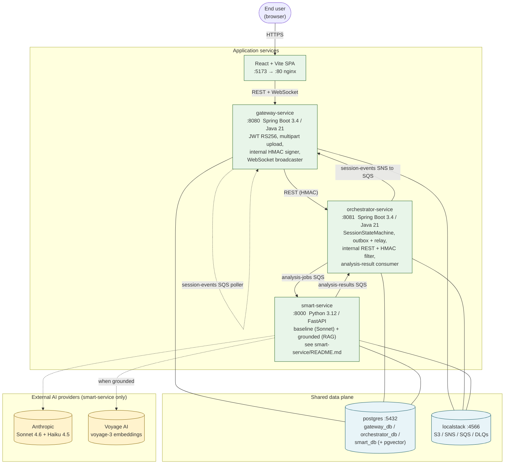

# fiap-secure-systems

Distributed system for AI-assisted architecture review. Three Spring Boot / Python services + a React SPA, all runnable via docker-compose.

## Status

| | |
|---|---|
| ci-smart       |              |
| ci-orchestrator|  |
| ci-gateway     |          |
| ci-frontend    |        |
| e2e            |                        |

## Quick start

```bash
make gen-jwt-keys       # generate RS256 keypair for gateway-service (gitignored)
make up                 # postgres + localstack + otel-collector
make smart-up           # add smart-service
make orch-up            # add orchestrator-service
make gw-up              # add gateway-service
make front-up           # add frontend (nginx)

make smoke              # PASS=19/0
make front-round-trip   # full SPA register → finalize → REPORT_READY
```

Browse the SPA at <http://localhost:5173>.

## Observability

```bash
make up-obs             # adds Tempo + Loki + Prometheus + Grafana
```

- Grafana: <http://localhost:3000> (anonymous admin) — five dashboards under "fiap-secure-systems":
  - `smart-service`, `orchestrator-service`, `gateway-service`, `frontend`, `session-lifecycle`
- Prometheus: <http://localhost:9090>
- Tempo: <http://localhost:3200>
- Loki: <http://localhost:3100>

## Architecture

See [`docs/superpowers/specs/2026-05-05-fiap-secure-systems-design.md`](docs/superpowers/specs/2026-05-05-fiap-secure-systems-design.md) for the design doc; sub-plans land under [`docs/superpowers/plans/`](docs/superpowers/plans/).



The smart-service module supports two interchangeable analysis pipelines
selected at boot via `SMART_ANALYSIS_STRATEGY`:

- **`baseline`** (default): single Sonnet 4.6 call with prompt-engineered JSON.
- **`grounded`**: four-stage RAG (Haiku vision extraction → canonicalisation →
  pgvector retrieval against a curated 30-pattern corpus → Sonnet tool-use
  emission with hallucination filter).

The two paths share the same `analysis-report.schema.json` and SQS envelope;
the optional `citations` field is populated on grounded outputs only. See
[`smart-service/README.md`](smart-service/README.md) for diagrams and details.

## AI/ML deliverable requirements

The project's AI/ML requirements (specified in Portuguese) — *detecção de
componentes em imagens, classificação de riscos, LLM com guardrails, prompt
engineering com avaliação de consistência*, plus the four minimum requirements
(*pipeline claro*, *justificativa*, *demonstração prática*, *discussão de
limitações*) — are cross-referenced to the implementing code in
[`smart-service/README.md` → "AI/ML requirements coverage"](smart-service/README.md#aiml-requirements-coverage).
Known limitations are consolidated in
[`smart-service/README.md` → "Known limitations"](smart-service/README.md#known-limitations).

## Contributing

See [`CONTRIBUTING.md`](CONTRIBUTING.md).
