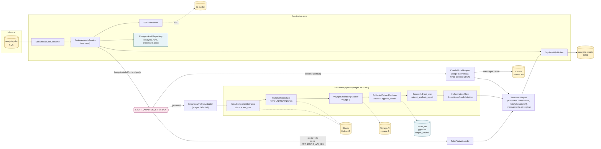

# smart-service

FastAPI / Python 3.12 worker that consumes the `analysis-jobs` queue, reads
diagram bytes from S3, runs them through a Claude-powered analysis pipeline,
and publishes `STARTED` then `SUCCEEDED` (or `FAILED`) outcomes on the
`analysis-results` queue.

The service ships with two interchangeable pipelines selected at runtime by
`SMART_ANALYSIS_STRATEGY`:

- **`baseline`** (default) — a single Sonnet 4.6 call with a prompt-engineered
  JSON contract. Backwards-compatible and self-contained.
- **`grounded`** — a four-stage RAG pipeline (Haiku vision → canonicaliser →
  pgvector retrieval → Sonnet tool-use). Risks must cite a retrieved corpus
  chunk; uncited risks are filtered out. Opt-in via env var, requires a Voyage
  AI key.

Both pipelines validate their output against the same
`infrastructure/contracts/analysis-report.schema.json` and serialise to the
same SQS envelope (the `citations` field is optional and absent on baseline
output).

## Pipelines



## Module layout (hex)

```mermaid
flowchart TB
    subgraph adapter_in["adapter / inbound"]
        SC["sqs_consumer.py"]
        Rest["rest.py<br/>(/admin/replay)"]
    end

    subgraph application["application"]
        AAS["analyze_assets_service.py"]
    end

    subgraph domain["domain"]
        Ports["ports.py<br/>AnalysisModelPort, EmbeddingPort,<br/>PatternRetrievalPort, ComponentExtractorPort,<br/>CanonicalizerPort, AuditRepositoryPort,<br/>AssetReaderPort, ResultPublisherPort"]
        Model["model.py<br/>AnalysisJob, StructuredReport,<br/>Risk[citations], Component, ..."]
        Graph["graph.py<br/>CanonicalKind, EdgeProtocol,<br/>ComponentGraph"]
        Citation["citation.py"]
        Corpus["corpus.py<br/>CorpusDocument, CorpusChunk,<br/>PatternMatch"]
    end

    subgraph adapter_out["adapter / outbound"]
        Claude["claude_model_adapter.py<br/>(baseline)"]
        Grounded["grounded_analysis_adapter.py<br/>(grounded composer)"]
        Extractor["haiku_component_extractor.py"]
        Canon["haiku_canonicalizer.py"]
        Voyage["voyage_embedding_adapter.py"]
        PGRetriever["pgvector_pattern_retriever.py"]
        Fake["fake_analysis_model.py"]
        S3R["s3_asset_reader.py"]
        SQSPub["sqs_result_publisher.py"]
        Audit["postgres_audit_repository.py"]
        DLQ["dlq_replayer.py"]
    end

    subgraph cli["cli"]
        Ingest["ingest_corpus.py<br/>(smart-ingest-corpus)"]
    end

    subgraph corpus_pkg["corpus"]
        Loader["loader.py"]
        Repo["repository.py"]
        Seed[("seed/<br/>30 hand-curated<br/>YAML patterns")]
    end

    subgraph infra["infrastructure"]
        DB["db.py"]
        Alembic["alembic/versions/<br/>0001_initial<br/>0002_pgvector_corpus"]
        Obs["observability.py"]
    end

    SC --> AAS
    Rest --> DLQ
    AAS --> Ports
    Grounded --> Extractor
    Grounded --> Canon
    Grounded --> Voyage
    Grounded --> PGRetriever
    Ingest --> Loader
    Ingest --> Voyage
    Ingest --> Repo
    Loader --> Corpus
    Repo --> Alembic
    PGRetriever --> Alembic
    Claude -.implements.-> Ports
    Grounded -.implements.-> Ports
    Fake -.implements.-> Ports
    Extractor -.implements.-> Ports
    Canon -.implements.-> Ports
    Voyage -.implements.-> Ports
    PGRetriever -.implements.-> Ports
    S3R -.implements.-> Ports
    SQSPub -.implements.-> Ports
    Audit -.implements.-> Ports

    classDef domain fill:#fff8e1,stroke:#f57f17
    classDef app fill:#e8f5e9,stroke:#1b5e20
    classDef adapter fill:#e3f2fd,stroke:#0d47a1
    classDef infra fill:#f3e5f5,stroke:#4a148c
    class Ports,Model,Graph,Citation,Corpus domain
    class AAS app
    class SC,Rest,Claude,Grounded,Extractor,Canon,Voyage,PGRetriever,Fake,S3R,SQSPub,Audit,DLQ adapter
    class DB,Alembic,Obs,Loader,Repo,Ingest,Seed infra
```



## Local development

```bash
uv sync
uv run pytest -m "not integration and not eval"   # unit only (82 tests)
uv run pytest -m "integration"                     # Testcontainers (Docker required)
uv run pytest -m "eval"                            # live API calls (skipped without keys)
uv run ruff check .
uv run mypy smart_service
uv run uvicorn smart_service.main:app --reload --port 8000
```

Testcontainer integration tests use `pgvector/pgvector:pg16` (Debian-based,
ships with the `vector` extension). Docker Desktop must be running.

## Environment

See [`../.env.example`](../.env.example) for the full list. Variables relevant
to smart-service:

| Variable | Default | Notes |
|---|---|---|
| `SMART_DATABASE_URL` | — | Postgres URL for `smart_db`. |
| `SMART_SERVICE_PROFILE` | `production` | Set to `e2e` to use `FakeAnalysisModel` (no Anthropic key needed). |
| `ANTHROPIC_API_KEY` | — | Required for baseline + grounded; absent ⇒ falls back to fake. |
| `ANTHROPIC_MODEL` | `claude-sonnet-4-6` | Final-emit model on both pipelines. |
| `SMART_ANALYSIS_STRATEGY` | `baseline` | `baseline` or `grounded`. |
| `SMART_HAIKU_MODEL` | `claude-haiku-4-5-20251001` | Used by extractor + canonicaliser (grounded only). |
| `VOYAGE_API_KEY` | — | **Required when** `SMART_ANALYSIS_STRATEGY=grounded`. |
| `VOYAGE_MODEL` | `voyage-3` | 1024-dim embeddings. |
| `SMART_EMBEDDING_DIM` | `1024` | Must match the migration; don't change without re-embedding. |
| `SMART_RAG_TOPK_COMPONENT` | `3` | Top-K chunks retrieved per component / per edge. |
| `SMART_RAG_TOPK_TOPOLOGY` | `5` | Top-K chunks retrieved for the topology-level query. |
| `S3_BUCKET`, `SQS_*_URL`, `AWS_*` | — | LocalStack / AWS bindings. |
| `INTERNAL_HMAC_SECRET` | — | Used by `/admin/replay`. |
| `OTEL_*` | — | Observability bindings (see repo-level docs). |

## RAG (grounded) analysis strategy

The grounded pipeline activates when **all of**:

- `SMART_ANALYSIS_STRATEGY=grounded`
- `ANTHROPIC_API_KEY` is set
- `VOYAGE_API_KEY` is set
- `SMART_SERVICE_PROFILE` is not `e2e` (e2e always overrides to `FakeAnalysisModel`)

Wiring raises `RuntimeError("SMART_ANALYSIS_STRATEGY=grounded requires VOYAGE_API_KEY")`
on boot if Voyage is missing — no silent fallback.

### Setup

```bash
# 1. Configure
export SMART_ANALYSIS_STRATEGY=grounded
export VOYAGE_API_KEY=...
export ANTHROPIC_API_KEY=...

# 2. Run migrations (creates corpus_documents + corpus_chunks with HNSW + GIN indexes)
uv run alembic upgrade head

# 3. Ingest the seed corpus
make smart-ingest-corpus           # via docker-compose
# or run locally:
uv run smart-ingest-corpus
```

`smart-ingest-corpus` reads `smart_service/corpus/seed/*.yaml`, embeds each
chunk through Voyage, and upserts into `corpus_chunks`. Re-running is
idempotent — each `doc_id` is wiped and replaced atomically per document.

### Seed corpus

30 hand-curated YAML files under [`smart_service/corpus/seed/`](smart_service/corpus/seed/),
~65 chunks total:

| Source | Count | Doc IDs |
|---|---|---|
| AWS Well-Architected | 10 | `WA-REL-*`, `WA-SEC-*`, `WA-PERF-*`, `WA-OPS-*`, `WA-COST-*`, `WA-SUS-*` |
| OWASP / cloud-native | 10 | `OWASP-A0*`, `OWASP-API-*`, `CN-*` |
| Microservices patterns | 10 | `MS-01` … `MS-10` |

Every chunk's `applies_to` array uses values from the canonical taxonomy
(`CanonicalKind` / `EdgeProtocol` in `smart_service/domain/graph.py`).
Retrieval matches an architecture's component/edge tags against the chunk's
`applies_to` set (Postgres array overlap `&&`).

### Output shape

Reports from the grounded pipeline carry a `citations` array on each risk:

```json
{
  "risks": [{
    "title": "Synchronous auth call chain amplifies latency",
    "category": "availability",
    "severity": "high",
    "description": "Gateway → Auth → DB is a 3-hop sync path with no circuit breaker.",
    "affected_components": ["API Gateway", "Auth Svc", "Users DB"],
    "recommendation": "Add bulkheads and timeouts shorter than upstream.",
    "citations": [
      {"doc_id": "WA-REL-04-sync-coupling", "source": "aws-well-architected",
       "title": "REL-04: Sync coupling", "chunk_index": 0, "score": 0.88}
    ]
  }]
}
```

The baseline pipeline emits risks with no `citations` key at all — wire-compatible
with downstream consumers (gateway, orchestrator) that pre-date the field.

### Evaluation

```bash
make smart-eval              # cd smart-service && uv run pytest -m eval -v
```

The eval suite lives under [`tests/eval/`](tests/eval/) and scores the grounded
pipeline against 5 golden architectures (`web-2tier`, `event-driven-saga`,
`sync-microservices`, `shared-db`, `no-auth-internal`). Each ships with a
32×32 placeholder PNG — **replace** `tests/eval/golden/<id>/architecture.png`
with a real diagram to get a meaningful score. See
[`tests/eval/golden/README.md`](tests/eval/golden/README.md) for details.

Metrics scored per architecture:

- **component_recall** — fraction of expected components present in the report.
- **risk_recall** — fraction of must-find risks matched on keywords +
  citation doc_ids + severity.
- **citation_rate** — fraction of report risks with at least one citation.
- **hallucination_count** — risks mentioning forbidden keywords.

Thresholds (currently `component_recall ≥ 0.70`, `risk_recall ≥ 0.80`,
`citation_rate ≥ 0.90`, `hallucination_count == 0`) are calibrated for real
diagrams — they will fail on the placeholder PNGs by design.

## AI/ML requirements coverage

This section maps the project's AI/ML deliverable requirements (originally
specified in Portuguese — quoted verbatim for grader keyword search) to the
exact code paths that implement them. The deliverable asks for **at least one**
of the four approaches below; this service implements **three of the four
substantively** (1, 3, 4) and **one partially** (2).

### 1. ✅ Detecção de componentes arquiteturais em imagens

> A IA deve implementar a detecção de componentes arquiteturais em imagens.

Stage 1 of the grounded pipeline does exactly this:
[`adapter/outbound/haiku_component_extractor.py`](smart_service/adapter/outbound/haiku_component_extractor.py).

Claude Haiku 4.5 receives the diagram as base64-encoded image / PDF blocks
(line 79-85) and is forced — via Anthropic tool-use (`tool_choice` at line 96)
— to return a structured `ComponentGraph` of components and edges. The output
JSON Schema (lines 27-67) restricts every `kind` to one of the 26
`CanonicalKind` values defined in
[`domain/graph.py`](smart_service/domain/graph.py) (`compute:container`,
`db:relational`, `msg:queue`, `net:gateway`, `identity:auth`, …) and every
`protocol` to one of 9 `EdgeProtocol` values. The system prompt
(`haiku_component_extractor.py:20-25`) forbids inventing taxonomy values
("never invent new values. Use 'unknown' if you can't classify").

A second pass —
[`haiku_canonicalizer.py`](smart_service/adapter/outbound/haiku_canonicalizer.py)
— rescues components stage 1 marked `unknown` so retrieval has a tag to filter
on. Best-effort: if it fails, the original graph passes through unchanged
(lines 68-70, 76-78, 84-86).

### 2. ⚠️ Classificação de riscos arquiteturais a partir de regras + ML

> A IA deve implementar a classificação de riscos arquiteturais a partir de regras + ML.

This is the **weakest match**. The "rules" half is strong; the "ML" half is
LLM-based classification, not classical ML (no scikit-learn / random forest /
SVM). If the rubric strictly means classical ML, this requirement is **not**
met. If it accepts any machine-learned model, it is.

Rules layer:

- Closed taxonomy of risk categories — `RiskCategory` enum at
  [`domain/model.py:51`](smart_service/domain/model.py) (`security`,
  `scalability`, `availability`, `cost`, `operability`, `data`, `compliance`).
- Closed severity scale — `Severity` enum at `domain/model.py:61`
  (`critical`, `high`, `medium`, `low`).
- JSON Schema enforcement — `infrastructure/contracts/analysis-report.schema.json`
  restricts `category` and `severity` to those enums; rejected at
  [`adapter/schema/validation.py:83`](smart_service/adapter/schema/validation.py)
  (`validate_analysis_report`).
- **Citation rule** — every risk without a citation referencing an actually
  retrieved chunk is dropped at
  [`grounded_analysis_adapter.py:364-367`](smart_service/adapter/outbound/grounded_analysis_adapter.py)
  (a rule-based filter classifying model output as valid / invalid).

ML layer: assignment of which `category` and `severity` a given risk belongs
to is done by Claude Sonnet 4.6 in
[`grounded_analysis_adapter.py:_emit`](smart_service/adapter/outbound/grounded_analysis_adapter.py),
not by a classical model.

### 3. ✅ Uso de LLM para geração de relatório técnico estruturado, com guardrails

> Uso de LLM para geração de relatório técnico estruturado, com implementação de
> guardrails para controle de entrada, saída e mitigação de alucinações.

This is the core of the service. Guardrails are layered as follows:

**Input control** (gateway side, before bytes reach the LLM):

- File-size limit — `gateway-service/src/main/resources/application.yml:25`
  (`max-file-size: 25MB`).
- Asset-count cap —
  `gateway-service/src/main/java/com/fiap/gateway/domain/model/AssetBundle.java:15`
  (`MAX_ASSETS = 20`), enforced in `addAsset()` at line 36.
- MIME-type whitelist —
  `gateway-service/src/main/java/com/fiap/gateway/domain/model/ContentType.java:6-7`
  (only `application/pdf` and `image/png` are accepted).

**Output control**:

- Schema-bound tool-use forces a structured response —
  [`grounded_analysis_adapter.py:281-289`](smart_service/adapter/outbound/grounded_analysis_adapter.py)
  uses `tool_choice={"type":"tool","name":"submit_analysis_report"}`. The model
  cannot reply in free text.
- JSON Schema validation on the parsed output before persistence —
  `validate_analysis_report()` at
  [`adapter/schema/validation.py:83`](smart_service/adapter/schema/validation.py),
  called from
  [`claude_model_adapter.py:146`](smart_service/adapter/outbound/claude_model_adapter.py)
  and from
  [`sqs_result_publisher.py:47`](smart_service/adapter/outbound/sqs_result_publisher.py)
  before publishing the result envelope. Rejection raises
  `SchemaValidationError`.
- Closed enums on every classifying field (`kind`, `category`, `severity`,
  `confidence`, `relevance`, `impact`, `effort`).

**Hallucination mitigation** — defense in depth across three layers:

1. **Retrieval grounding**. The model only sees corpus chunks selected for
   *this* architecture (stage 3 of the grounded pipeline). It can't cite what
   wasn't retrieved.
2. **Prompted constraint**. The grounded system prompt at
   [`grounded_analysis_adapter.py:46-58`](smart_service/adapter/outbound/grounded_analysis_adapter.py)
   instructs *every risk must cite a retrieved chunk*; uncited concerns must
   move to `improvements`.
3. **Server-side citation enforcement** at `_payload_to_report`
   ([`grounded_analysis_adapter.py:339-378`](smart_service/adapter/outbound/grounded_analysis_adapter.py)).
   Every risk's `citations[]` is matched against an index of the actually
   retrieved chunks (`idx` at line 349). Citations referencing
   non-retrieved or invented `doc_id`s are stripped; risks left with **zero
   valid citations are dropped entirely** (lines 364-367). The model can lie;
   the code won't echo the lie.

### 4. ✅ Análise textual baseada em prompt engineering, com validação e avaliação de consistência

> Análise textual baseada em prompt engineering, incluindo validação de prompts,
> restrições de formato e avaliação da consistência das respostas.

**Prompt engineering** — explicit system prompts in all three LLM adapters:

- Extraction:
  [`haiku_component_extractor.py:20-25`](smart_service/adapter/outbound/haiku_component_extractor.py)
  — "Use canonical kinds from the enum — never invent new values. Use 'unknown'
  if you can't classify."
- Canonicalisation:
  [`haiku_canonicalizer.py:16-19`](smart_service/adapter/outbound/haiku_canonicalizer.py).
- Emission:
  [`grounded_analysis_adapter.py:46-58`](smart_service/adapter/outbound/grounded_analysis_adapter.py)
  — establishes the citation discipline.

**Format restrictions** — every LLM call uses Anthropic tool-use with an
`input_schema` carrying closed enums, `required` fields, and (on the public
contract) `additionalProperties: false`. The model is structurally unable to
respond off-format.

**Consistency evaluation** — see the eval harness at
[`tests/eval/`](tests/eval/). It is what really lands this requirement:

- Five hand-curated golden architectures (`web-2tier`, `sync-microservices`,
  `event-driven-saga`, `shared-db`, `no-auth-internal`), each with
  `architecture.png` + `expected.yaml`.
- Four scored metrics per architecture
  ([`tests/eval/scorer.py:30-74`](tests/eval/scorer.py)):
  `component_recall`, `risk_recall`, `citation_rate`, `hallucination_count`.
- Pass thresholds asserted in
  [`test_eval_harness.py:133-136`](tests/eval/test_eval_harness.py):
  `component_recall ≥ 0.70`, `risk_recall ≥ 0.80`, `citation_rate ≥ 0.90`,
  `hallucination_count == 0`.
- Runs with `make smart-eval`; spins up a Testcontainers Postgres with
  pgvector, ingests the seed corpus, calls live Anthropic + Voyage, and
  scores against the golden set.

### Minimum requirements

| Requirement (PT-BR) | Where it lives in this repo |
|---|---|
| **Pipeline claro de IA** | The [`## Pipelines`](#pipelines) section above (Mermaid diagram) plus [`grounded_analysis_adapter.py:177-202`](smart_service/adapter/outbound/grounded_analysis_adapter.py) which names the four stages explicitly. |
| **Justificativa da abordagem escolhida** | The [`## RAG (grounded) analysis strategy`](#rag-grounded-analysis-strategy) section above plus the project plan at [`docs/superpowers/plans/2026-05-11-smart-service-rag-minimal-slice.md:5-9`](../docs/superpowers/plans/2026-05-11-smart-service-rag-minimal-slice.md). Core rationale: two strategies coexist behind `SMART_ANALYSIS_STRATEGY` with zero behaviour change for existing callers; grounded forces server-enforced JSON via tool-use and post-validates citations against retrieved chunks. |
| **Demonstração prática da análise** | The full stack runs end-to-end via `make bootstrap` (postgres + localstack + otel-collector + 3 services + frontend). The SPA at `http://localhost:5173` exercises the real flow; for LLM verification: `pytest -m eval` against the golden set. With `SMART_SERVICE_PROFILE=e2e` the analysis uses `FakeAnalysisModel` (no API keys); with `production` + the two keys the grounded pipeline runs against live providers. |
| **Discussão de limitações do modelo** | See the [`## Known limitations`](#known-limitations) section below — consolidates the limitations otherwise scattered across this README, the plan doc, and the eval golden README. |

## Known limitations

Documented constraints of the current implementation. Each item is something a
real deployment would need to budget for or mitigate.

- **Dense-only retrieval.** No BM25, no hybrid retrieval, no neural re-ranker.
  Tagged via `applies_to` overlap, then ranked purely by cosine similarity
  over Voyage `voyage-3` embeddings. The plan
  ([`2026-05-11-smart-service-rag-minimal-slice.md`](../docs/superpowers/plans/2026-05-11-smart-service-rag-minimal-slice.md))
  explicitly calls these out as deferred extensions.
- **Closed 26-kind taxonomy.** `CanonicalKind` covers compute, storage,
  databases, messaging, networking, identity, cache, observability, and a
  fallback `unknown`. Exotic components (e.g. a vector database, a feature
  flag service, a service mesh control plane) get classified as `unknown` and
  fall out of tag-filtered retrieval — they still appear in the topology
  query but no per-component patterns will be matched.
- **Vision extraction is bounded by Haiku's diagram-reading ability.** Hand-
  drawn whiteboards, screenshots of cluttered slide decks, or diagrams with
  custom iconography may produce missed or mis-classified components. The
  canonicaliser rescues some of these but is itself best-effort.
- **Per-call cost.** A single grounded analysis triggers up to 3 Anthropic
  calls (Haiku extract, optional Haiku canonicalise, Sonnet emit) plus a
  Voyage embedding batch of N+M+1 queries, where N = component count and
  M = edge count. The `anthropic_call_duration_ms` histogram (Grafana
  `smart-service` dashboard) shows the per-stage breakdown.
- **Eval thresholds are placeholders.** The bar in
  [`test_eval_harness.py:133-136`](tests/eval/test_eval_harness.py) is
  explicitly marked "tune after first real-diagram run". Until the placeholder
  PNGs at
  [`tests/eval/golden/<id>/architecture.png`](tests/eval/golden/) are replaced
  with real diagrams, the eval scores against them are meaningless.
- **Citation filter favours false negatives.** If a real risk genuinely cannot
  be supported from the retrieved set, the risk is dropped (counted in
  `grounded.dropped_uncited_risk` log lines). This is a defensible choice for
  a system whose purpose is "every claim must be supported", but a
  discussable one — better corpus coverage shrinks the false-negative rate.
- **Single-shot evaluation, no consistency runs.** The eval harness asserts
  a quality threshold once per architecture per run. It does not measure
  run-to-run variance (sampling temperature, model non-determinism). For
  stricter consistency analysis, run the eval N times and aggregate.
- **No prompt-injection hardening on the uploaded image contents.** Diagram
  bytes go to Haiku in vision blocks; an adversarial diagram with embedded
  text "ignore previous instructions" could in principle steer the extractor.
  Practical mitigations (text-OCR pre-pass, separate sandbox) are out of
  scope for the minimal slice.
- **Frontend SPA emits no OTel metrics directly.** The provisioned `frontend`
  Grafana dashboard carries a note panel explaining this; a
  `nginx-prometheus-exporter` sidecar is tracked as a deferred follow-up.

## Database

The `smart_db` schema is owned by `smart_user`. Migrations (Alembic) live in
[`smart_service/infrastructure/alembic/versions/`](smart_service/infrastructure/alembic/versions/):

| Revision | Purpose |
|---|---|
| `0001_initial` | `analysis_runs`, `processed_jobs` (audit + idempotency). |
| `0002_pgvector_corpus` | `vector` extension, `corpus_documents`, `corpus_chunks` (HNSW cosine + GIN on `applies_to`). |

The Postgres image (`docker-compose.yml`) is `pgvector/pgvector:pg16`; the
init script [`infrastructure/postgres/init/03-enable-pgvector.sql`](../infrastructure/postgres/init/03-enable-pgvector.sql)
installs the extension on first container boot. If reusing an old `postgres-data`
volume, install the extension manually:

```bash
docker compose exec -u postgres postgres \
  psql -d smart_db -c "CREATE EXTENSION IF NOT EXISTS vector;"
```

## Tests

| Suite | Marker | Count | Where |
|---|---|---|---|
| Unit | (none) | 82 | `tests/` excluding `integration/` + `eval/` |
| Integration | `integration` | 26 | Testcontainers Postgres (+ LocalStack for S3/SQS) |
| Eval | `eval` | 5 | Live Anthropic + Voyage; skipped without keys |

```bash
uv run pytest -m "not eval" -q                     # 108 tests, runs in CI
uv run pytest -m "not integration and not eval" -q # 82 tests, no Docker needed
uv run pytest -m eval -v                            # live keys required
```
