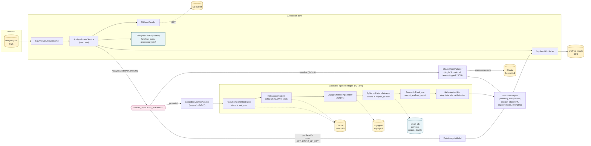

# smart-service

FastAPI / Python 3.12 worker that consumes the `analysis-jobs` queue, reads
diagram bytes from S3, runs them through a Claude-powered analysis pipeline,
and publishes `STARTED` then `SUCCEEDED` (or `FAILED`) outcomes on the
`analysis-results` queue.

The service ships with two interchangeable pipelines selected at runtime by
`SMART_ANALYSIS_STRATEGY`:

- **`baseline`** (default) — a single Sonnet 4.6 call with a prompt-engineered
  JSON contract. Backwards-compatible and self-contained.
- **`grounded`** — a four-stage RAG pipeline (Haiku vision → canonicaliser →
  pgvector retrieval → Sonnet tool-use). Risks must cite a retrieved corpus
  chunk; uncited risks are filtered out. Opt-in via env var, requires a Voyage
  AI key.

Both pipelines validate their output against the same
`infrastructure/contracts/analysis-report.schema.json` and serialise to the
same SQS envelope (the `citations` field is optional and absent on baseline
output).

## Pipelines



## Module layout (hex)

```mermaid
flowchart TB
    subgraph adapter_in["adapter / inbound"]
        SC["sqs_consumer.py"]
        Rest["rest.py<br/>(/admin/replay)"]
    end

    subgraph application["application"]
        AAS["analyze_assets_service.py"]
    end

    subgraph domain["domain"]
        Ports["ports.py<br/>AnalysisModelPort, EmbeddingPort,<br/>PatternRetrievalPort, ComponentExtractorPort,<br/>CanonicalizerPort, AuditRepositoryPort,<br/>AssetReaderPort, ResultPublisherPort"]
        Model["model.py<br/>AnalysisJob, StructuredReport,<br/>Risk[citations], Component, ..."]
        Graph["graph.py<br/>CanonicalKind, EdgeProtocol,<br/>ComponentGraph"]
        Citation["citation.py"]
        Corpus["corpus.py<br/>CorpusDocument, CorpusChunk,<br/>PatternMatch"]
    end

    subgraph adapter_out["adapter / outbound"]
        Claude["claude_model_adapter.py<br/>(baseline)"]
        Grounded["grounded_analysis_adapter.py<br/>(grounded composer)"]
        Extractor["haiku_component_extractor.py"]
        Canon["haiku_canonicalizer.py"]
        Voyage["voyage_embedding_adapter.py"]
        PGRetriever["pgvector_pattern_retriever.py"]
        Fake["fake_analysis_model.py"]
        S3R["s3_asset_reader.py"]
        SQSPub["sqs_result_publisher.py"]
        Audit["postgres_audit_repository.py"]
        DLQ["dlq_replayer.py"]
    end

    subgraph cli["cli"]
        Ingest["ingest_corpus.py<br/>(smart-ingest-corpus)"]
    end

    subgraph corpus_pkg["corpus"]
        Loader["loader.py"]
        Repo["repository.py"]
        Seed[("seed/<br/>30 hand-curated<br/>YAML patterns")]
    end

    subgraph infra["infrastructure"]
        DB["db.py"]
        Alembic["alembic/versions/<br/>0001_initial<br/>0002_pgvector_corpus"]
        Obs["observability.py"]
    end

    SC --> AAS
    Rest --> DLQ
    AAS --> Ports
    Grounded --> Extractor
    Grounded --> Canon
    Grounded --> Voyage
    Grounded --> PGRetriever
    Ingest --> Loader
    Ingest --> Voyage
    Ingest --> Repo
    Loader --> Corpus
    Repo --> Alembic
    PGRetriever --> Alembic
    Claude -.implements.-> Ports
    Grounded -.implements.-> Ports
    Fake -.implements.-> Ports
    Extractor -.implements.-> Ports
    Canon -.implements.-> Ports
    Voyage -.implements.-> Ports
    PGRetriever -.implements.-> Ports
    S3R -.implements.-> Ports
    SQSPub -.implements.-> Ports
    Audit -.implements.-> Ports

    classDef domain fill:#fff8e1,stroke:#f57f17
    classDef app fill:#e8f5e9,stroke:#1b5e20
    classDef adapter fill:#e3f2fd,stroke:#0d47a1
    classDef infra fill:#f3e5f5,stroke:#4a148c
    class Ports,Model,Graph,Citation,Corpus domain
    class AAS app
    class SC,Rest,Claude,Grounded,Extractor,Canon,Voyage,PGRetriever,Fake,S3R,SQSPub,Audit,DLQ adapter
    class DB,Alembic,Obs,Loader,Repo,Ingest,Seed infra
```



## Local development

```bash
uv sync
uv run pytest -m "not integration and not eval"   # unit only (82 tests)
uv run pytest -m "integration"                     # Testcontainers (Docker required)
uv run pytest -m "eval"                            # live API calls (skipped without keys)
uv run ruff check .
uv run mypy smart_service
uv run uvicorn smart_service.main:app --reload --port 8000
```

Testcontainer integration tests use `pgvector/pgvector:pg16` (Debian-based,
ships with the `vector` extension). Docker Desktop must be running.

## Environment

See [`../.env.example`](../.env.example) for the full list. Variables relevant
to smart-service:

| Variable | Default | Notes |
|---|---|---|
| `SMART_DATABASE_URL` | — | Postgres URL for `smart_db`. |
| `SMART_SERVICE_PROFILE` | `production` | Set to `e2e` to use `FakeAnalysisModel` (no Anthropic key needed). |
| `ANTHROPIC_API_KEY` | — | Required for baseline + grounded; absent ⇒ falls back to fake. |
| `ANTHROPIC_MODEL` | `claude-sonnet-4-6` | Final-emit model on both pipelines. |
| `SMART_ANALYSIS_STRATEGY` | `baseline` | `baseline` or `grounded`. |
| `SMART_HAIKU_MODEL` | `claude-haiku-4-5-20251001` | Used by extractor + canonicaliser (grounded only). |
| `VOYAGE_API_KEY` | — | **Required when** `SMART_ANALYSIS_STRATEGY=grounded`. |
| `VOYAGE_MODEL` | `voyage-3` | 1024-dim embeddings. |
| `SMART_EMBEDDING_DIM` | `1024` | Must match the migration; don't change without re-embedding. |
| `SMART_RAG_TOPK_COMPONENT` | `3` | Top-K chunks retrieved per component / per edge. |
| `SMART_RAG_TOPK_TOPOLOGY` | `5` | Top-K chunks retrieved for the topology-level query. |
| `S3_BUCKET`, `SQS_*_URL`, `AWS_*` | — | LocalStack / AWS bindings. |
| `INTERNAL_HMAC_SECRET` | — | Used by `/admin/replay`. |
| `OTEL_*` | — | Observability bindings (see repo-level docs). |

## RAG (grounded) analysis strategy

The grounded pipeline activates when **all of**:

- `SMART_ANALYSIS_STRATEGY=grounded`
- `ANTHROPIC_API_KEY` is set
- `VOYAGE_API_KEY` is set
- `SMART_SERVICE_PROFILE` is not `e2e` (e2e always overrides to `FakeAnalysisModel`)

Wiring raises `RuntimeError("SMART_ANALYSIS_STRATEGY=grounded requires VOYAGE_API_KEY")`
on boot if Voyage is missing — no silent fallback.

### Setup

```bash
# 1. Configure
export SMART_ANALYSIS_STRATEGY=grounded
export VOYAGE_API_KEY=...
export ANTHROPIC_API_KEY=...

# 2. Run migrations (creates corpus_documents + corpus_chunks with HNSW + GIN indexes)
uv run alembic upgrade head

# 3. Ingest the seed corpus
make smart-ingest-corpus           # via docker-compose
# or run locally:
uv run smart-ingest-corpus
```

`smart-ingest-corpus` reads `smart_service/corpus/seed/*.yaml`, embeds each
chunk through Voyage, and upserts into `corpus_chunks`. Re-running is
idempotent — each `doc_id` is wiped and replaced atomically per document.

### Seed corpus

30 hand-curated YAML files under [`smart_service/corpus/seed/`](smart_service/corpus/seed/),
~65 chunks total:

| Source | Count | Doc IDs |
|---|---|---|
| AWS Well-Architected | 10 | `WA-REL-*`, `WA-SEC-*`, `WA-PERF-*`, `WA-OPS-*`, `WA-COST-*`, `WA-SUS-*` |
| OWASP / cloud-native | 10 | `OWASP-A0*`, `OWASP-API-*`, `CN-*` |
| Microservices patterns | 10 | `MS-01` … `MS-10` |

Every chunk's `applies_to` array uses values from the canonical taxonomy
(`CanonicalKind` / `EdgeProtocol` in `smart_service/domain/graph.py`).
Retrieval matches an architecture's component/edge tags against the chunk's
`applies_to` set (Postgres array overlap `&&`).

### Output shape

Reports from the grounded pipeline carry a `citations` array on each risk:

```json
{
  "risks": [{
    "title": "Synchronous auth call chain amplifies latency",
    "category": "availability",
    "severity": "high",
    "description": "Gateway → Auth → DB is a 3-hop sync path with no circuit breaker.",
    "affected_components": ["API Gateway", "Auth Svc", "Users DB"],
    "recommendation": "Add bulkheads and timeouts shorter than upstream.",
    "citations": [
      {"doc_id": "WA-REL-04-sync-coupling", "source": "aws-well-architected",
       "title": "REL-04: Sync coupling", "chunk_index": 0, "score": 0.88}
    ]
  }]
}
```

The baseline pipeline emits risks with no `citations` key at all — wire-compatible
with downstream consumers (gateway, orchestrator) that pre-date the field.

### Evaluation

```bash
make smart-eval              # cd smart-service && uv run pytest -m eval -v
```

The eval suite lives under [`tests/eval/`](tests/eval/) and scores the grounded
pipeline against 5 golden architectures (`web-2tier`, `event-driven-saga`,
`sync-microservices`, `shared-db`, `no-auth-internal`). Each ships with a
32×32 placeholder PNG — **replace** `tests/eval/golden/<id>/architecture.png`
with a real diagram to get a meaningful score. See
[`tests/eval/golden/README.md`](tests/eval/golden/README.md) for details.

Metrics scored per architecture:

- **component_recall** — fraction of expected components present in the report.
- **risk_recall** — fraction of must-find risks matched on keywords +
  citation doc_ids + severity.
- **citation_rate** — fraction of report risks with at least one citation.
- **hallucination_count** — risks mentioning forbidden keywords.

Thresholds (currently `component_recall ≥ 0.70`, `risk_recall ≥ 0.80`,
`citation_rate ≥ 0.90`, `hallucination_count == 0`) are calibrated for real
diagrams — they will fail on the placeholder PNGs by design.

## Database

The `smart_db` schema is owned by `smart_user`. Migrations (Alembic) live in
[`smart_service/infrastructure/alembic/versions/`](smart_service/infrastructure/alembic/versions/):

| Revision | Purpose |
|---|---|
| `0001_initial` | `analysis_runs`, `processed_jobs` (audit + idempotency). |
| `0002_pgvector_corpus` | `vector` extension, `corpus_documents`, `corpus_chunks` (HNSW cosine + GIN on `applies_to`). |

The Postgres image (`docker-compose.yml`) is `pgvector/pgvector:pg16`; the
init script [`infrastructure/postgres/init/03-enable-pgvector.sql`](../infrastructure/postgres/init/03-enable-pgvector.sql)
installs the extension on first container boot. If reusing an old `postgres-data`
volume, install the extension manually:

```bash
docker compose exec -u postgres postgres \
  psql -d smart_db -c "CREATE EXTENSION IF NOT EXISTS vector;"
```

## Tests

| Suite | Marker | Count | Where |
|---|---|---|---|
| Unit | (none) | 82 | `tests/` excluding `integration/` + `eval/` |
| Integration | `integration` | 26 | Testcontainers Postgres (+ LocalStack for S3/SQS) |
| Eval | `eval` | 5 | Live Anthropic + Voyage; skipped without keys |

```bash
uv run pytest -m "not eval" -q                     # 108 tests, runs in CI
uv run pytest -m "not integration and not eval" -q # 82 tests, no Docker needed
uv run pytest -m eval -v                            # live keys required
```
